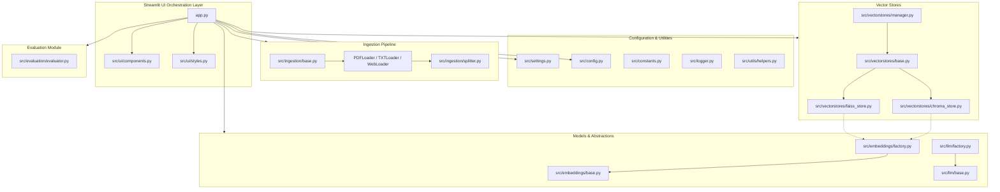

# System Architecture

The **Smart Research Assistant** is built on a highly modular, decoupled architecture where the user interface, business logic, ingestion pipelines, storage interfaces, and models are separated into distinct modules. 

This decoupling ensures that:
- Adding a new file loader format does not affect the UI or LLM logic.
- Switching from FAISS to ChromaDB (or vice versa) is a configuration change.
- Swapping the LLM provider (e.g., OpenAI to Anthropic or a local Ollama model) does not break prompt formatting.
- Evaluation runs as an independent post-processing/validation layer.

---

## Component Architecture

Below is the component relationship diagram illustrating the data flow and orchestration.

## Architectural Highlights

1. **Streamlit App (`app.py`)**: Responsible only for user session states, routing tabs (Upload, Chat, Evaluation), and layout rendering.
2. **Configuration Class (`src/config.py`)**: Uses Pydantic Settings (or a structured validation class) to read and assert environment variables from `.env`.
3. **Common Interfaces**:
   - `BaseDocumentLoader`: Guarantees consistent format retrieval.
   - `BaseVectorStore`: Abstracts vector operations so that swapping from ChromaDB to FAISS requires only changing `VECTOR_STORE_TYPE` in `.env`.
   - `BaseLLMProvider`: Standardizes request/response schemas across OpenAI, Anthropic, Ollama, and Hugging Face.
