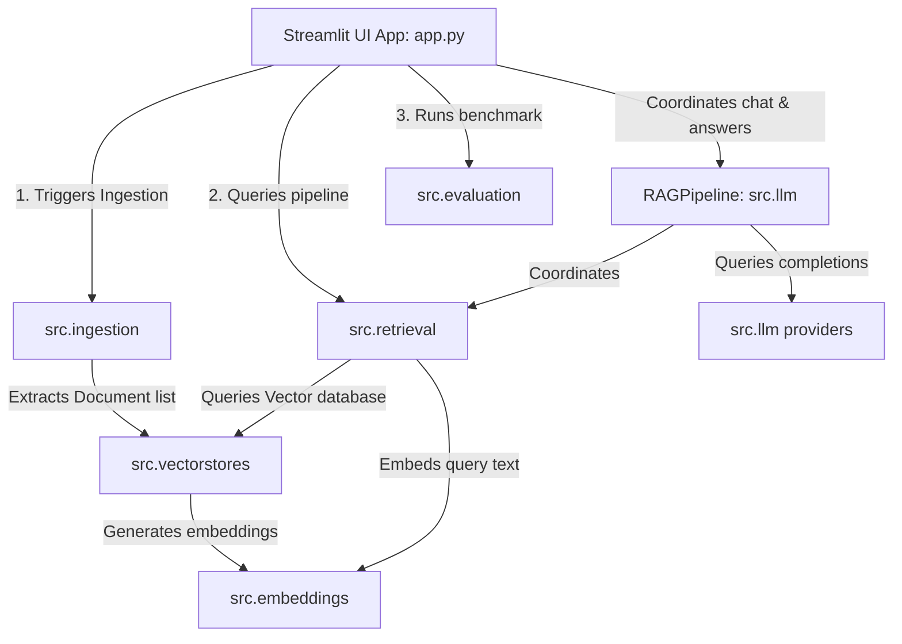
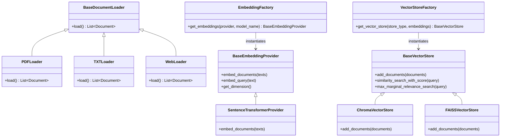
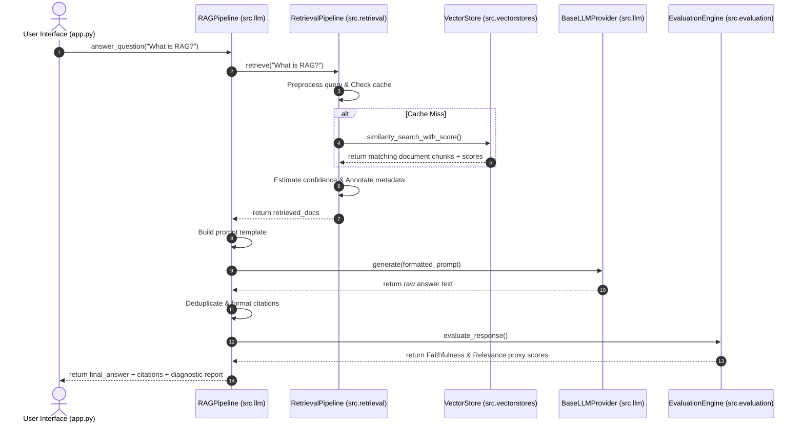
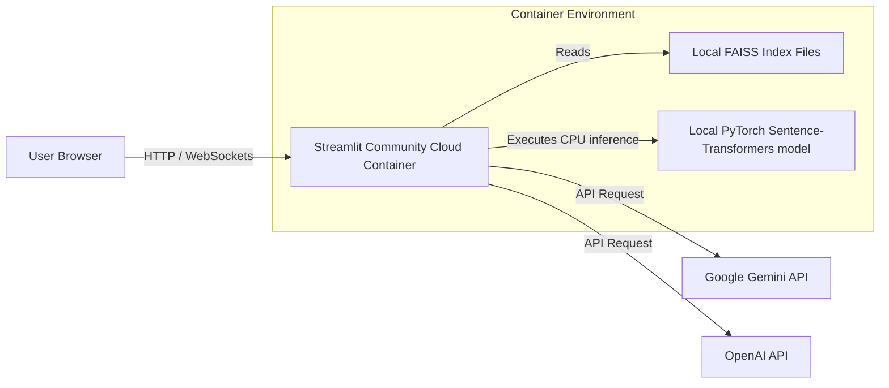

# System Architecture - Smart Research Assistant 📐
> High-level design, decoupled package dependencies, metadata propagation paths, and deployment specifications.

---

## 📖 Table of Contents
1. [Overall System Component Architecture](#overall-system-component-architecture)
2. [Class Interaction Diagram (High Level)](#class-interaction-diagram-high-level)
3. [Sequence Diagram for Question Answering](#sequence-diagram-for-question-answering)
4. [Deployment Architecture Diagram](#deployment-architecture-diagram)
5. [Decoupled Architecture & SOLID Principles](#decoupled-architecture--solid-principles)

---

## 1. Overall System Component Architecture
The application is structured into isolated packages under `src/`. No backend package imports from Streamlit, maintaining strict separation of concerns:

---

## 2. Class Interaction Diagram (High Level)
Shows class relations and factories:

---

## 3. Sequence Diagram for Question Answering
The execution trace of a query processed by `RAGPipeline`:

---

## 4. Deployment Architecture Diagram
Shows the physical packaging and networking configurations:

---

## 5. Decoupled Architecture & SOLID Principles

- **Single Responsibility (SRP)**: The text preprocessing module does nothing except sanitize text blocks; it has no awareness of FAISS or Chroma. The embedding factory deals only with model caching, not text chunking.
- **Open/Closed (OCP)**: Adding a new LLM provider (such as Anthropic or Cohere) or a new vector database (such as Qdrant or Pinecone) requires writing a new subclass without modifying any of the existing pipeline code.
- **Liskov Substitution (LSP)**: `ChromaVectorStore` and `FAISSVectorStore` are fully interchangeable. The application behaves identically regardless of which database is swapped in.
- **Interface Segregation (ISP)**: Custom loaders conform to `BaseDocumentLoader`, exposing only `.load()` to the preprocessing parser.
- **Dependency Inversion (DIP)**: High-level modules (like the RAG Pipeline orchestrator) depend only on abstractions (`BaseVectorStore`, `BaseLLMProvider`, `BaseEmbeddingProvider`) rather than concrete library packages.
