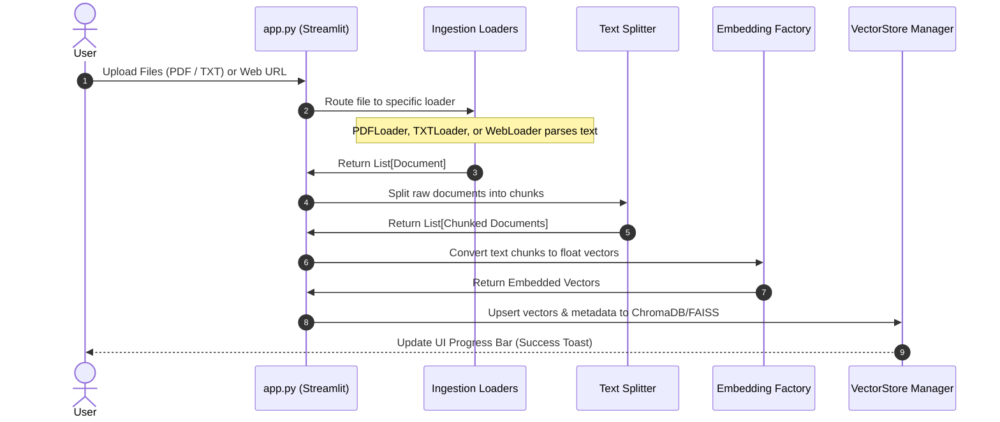
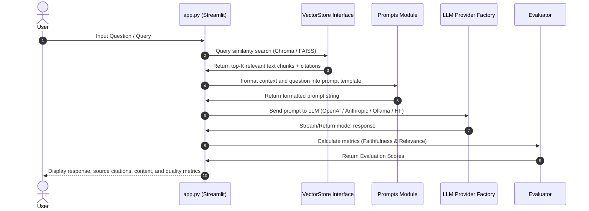

# RAG Workflows

The **Smart Research Assistant** runs two core workflows:
1. **Document Ingestion Workflow**: Parsing uploaded files, splitting them into logical chunks, converting chunks to embeddings, and loading them into the configured Vector Store.
2. **Query & Retrieval Workflow**: Transforming user questions, searching the Vector Store, assembling context-augmented prompts, executing LLM inference, and evaluating quality.

---

## 1. Document Ingestion Workflow

This workflow is triggered when a user uploads documents via the UI dashboard.

---

## 2. Query & Retrieval Workflow

This workflow is executed when a user submits a search or question in the chat interface.

